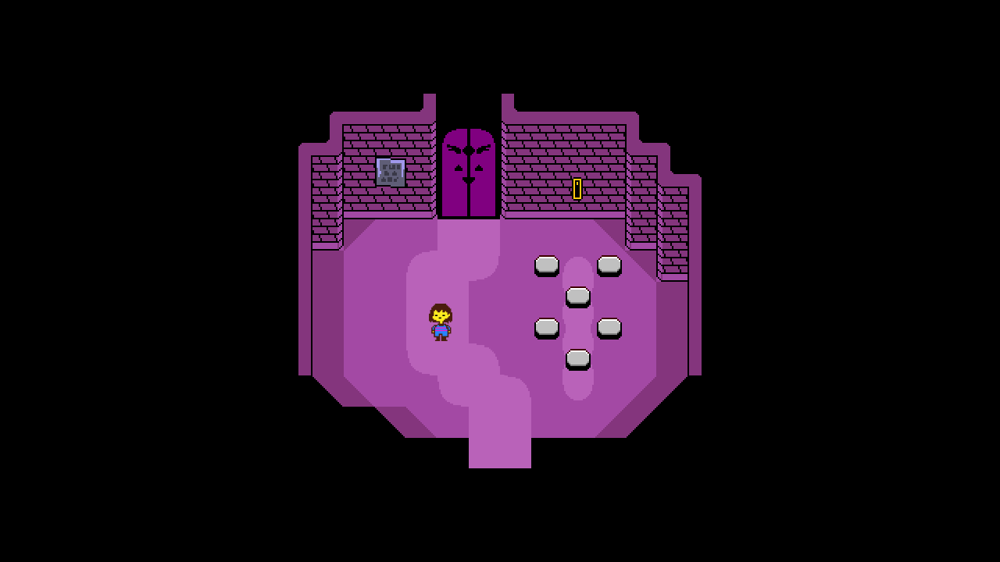

    
    <h1>example.ha</h1>
    
A program that shows some of raylib bindings in use

### Keybinds  
#### Keyboard  
- W/A/S/D - Moves the center square
- Space - Take Screenshot
- C - Opens up your default web browser on the url of this repo
- I - Debug info (title, controller name, resolution, fps)
- 1...9 - Changes center square color

#### Mouse  
- Left/Right/Middle Click - Changes center square color
- Wheel Up/Down - Zoom in and out

#### Gamepad  
- Left analog stick - Moves the center square
- D-PAD - Changes the center square size
- LB - Rotate screen counter-clock-wise
- RB - Rotate screen clock-wise
- LT - Zoom out
- RT - Zoom in
- Select - Rotation reset
- Start - Zoom reset
- X/Y/A/B - Changes center square color
- Right analog stick click - Debug info (title, controller name, resolution,
  fps)
