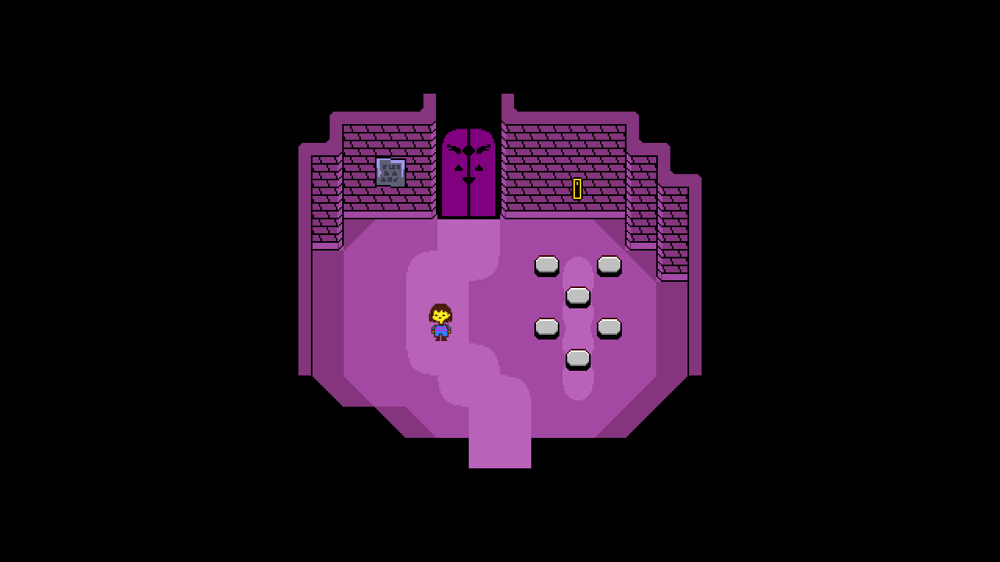

    
    <h1>example.ha</h1>
    
A example that shows some of raylib bindings in use

### Keybinds  
#### Keyboard  
- W/A/S/D - Moves the player
- Space - Take Screenshot
- C - Opens up your default web browser on the url of this repo
- I - Debug info (title, controller name, resolution, fps)

#### Gamepad  
- Left analog stick - Moves the player
- Right analog stick click - Debug info (title, controller name, resolution,
  fps)
